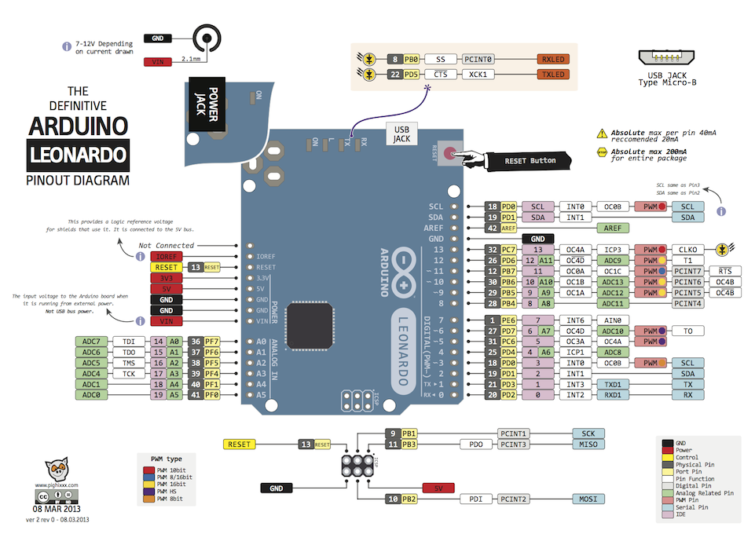

# Arduino RFID Controller para *Bomber Rush*

Este projeto contém um código para o **Arduino Leonardo** que utiliza um sensor **RFID RC522** para ler cartões e ativar eventos dentro do jogo **Bomber Rush**.

O Arduino funciona como um **teclado USB**: quando um cartão RFID é lido, ele envia uma tecla específica para o computador, e o jogo interpreta isso como um *power-up* ou evento especial.

O jogo **Bomber Rush** (em C) está disponível aqui:  
https://github.com/iampassos/bomber-rush

A ideia é permitir que cartões RFID atuem como **gatilhos físicos**, integrando elementos reais ao gameplay.

---

# Pinagem do Arduino Leonardo

## 📌 Conexões da Fita LED (WS2812 / Neopixel)
- **Data In** → Pino **7**
- **VCC (5V)** → 5V
- **GND** → GND

---

## 📌 Conexões do Leitor RFID RC522
- **3.3V** → 3.3V  
- **RST** → Pino **9**  
- **GND** → GND  
- **IRQ** → Não usado  
- **MISO** → MISO (ICSP)  
- **MOSI** → MOSI (ICSP)  
- **SCK** → SCK (ICSP)  
- **SDA / SS** → Pino **10**

---

# 📷 Imagem do Arduino Leonardo

